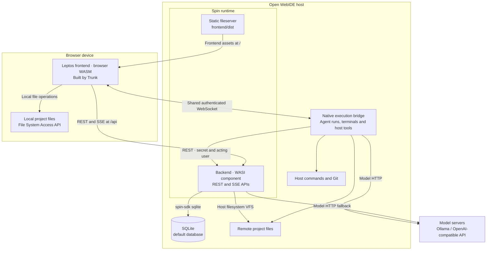
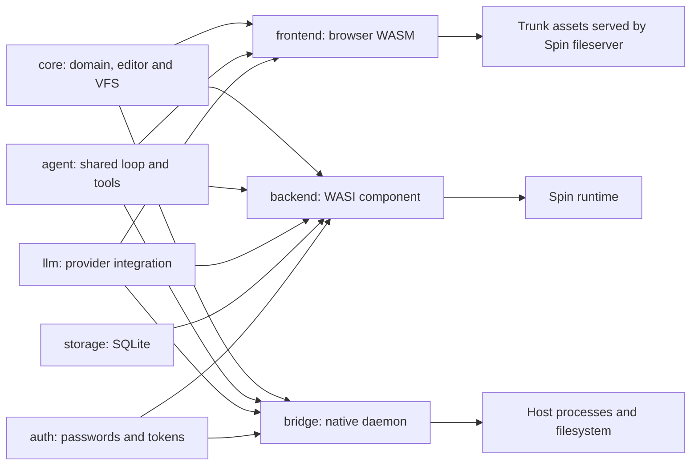
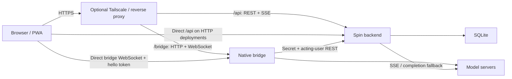
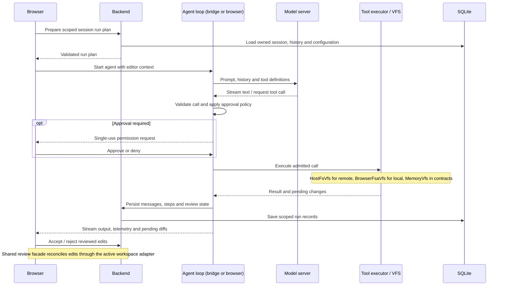
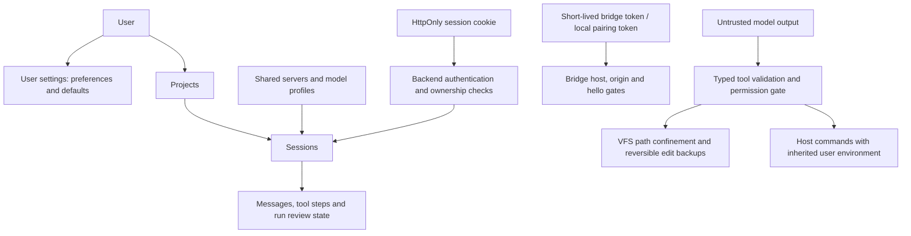

# Architecture

## Goals

1. **Full stack in WebAssembly.** The frontend is a Leptos WASM app; the
   backend is a Spin component (`wasm32-wasip2`). A native Rust bridge
   runs beside Spin for terminals, host tools, and chat/agent execution.
2. **Local-LLM first.** Ollama and llama.cpp sit behind one provider
   interface so the UI never cares which engine is serving.
3. **File-based persistence.** SQLite, the same shape Open WebUI uses,
   storing preferences, LLM connections, settings, and system prompts.
4. **Single shared core, thin boundary shims.** Avoid dual implementations.
   Everything above the I/O boundary (the agent loop, VFS tool execution,
   editor surface, diff computation, and in-memory WASM linting) is 100% shared
   code. Local and Remote modes are strictly thin shims bridging the physical
   I/O boundary (Spin REST vs. browser File System Access handles), ensuring
   features never drift between modes.

## Shared feature boundaries

UI actions, slash commands, and background refresh use the same feature entry points:

| Feature | Shared behavior | Host primitives |
| --- | --- | --- |
| Files and search | `Workspace`, core `Vfs`, shared path validation and ordering | Browser `BrowserFsaVfs`, backend `HostFsVfs`, bridge `NativeFsVfs` |
| Git and terminals | `ProjectGit` / `ProjectHost`, shared Git types and bridge execution | Backend REST or authenticated browser bridge transport |
| Chat and agent runs | `ProjectRuns`, agent `session::plan`, `chat_events`, `events`, agent loop and approval policy | Browser, Spin and bridge persistence, cancellation, permission and HTTP adapters |
| Model setup | Frontend `model_setup` connect/discover/apply facade, core detection default merging and shared provider probes | Backend server/model/configuration primitives, execution-host discovery adapters |
| Model requests | `ModelRuntime::apply_to`, provider wire messages and stream state machines | Protocol parsers and browser/Spin/native HTTP clients |
| Context compaction | Agent `compaction::prepare`, bounded rolling summaries, separate compaction reserves, per-request remaining-context reply budgets and persisted history reconstruction | `CompactionSource` model runtime/completion/token primitives for browser, Spin and bridge |
| History recovery | Core interrupted-run validation and tool-history reconstruction | Persisted messages and tool results, UI presentation mapping |

Mode checks belong to selecting these adapters and browser folder permissions. New
features extend the shared entry point; adapters supply operations, never a second
workflow. Cancellation, fallback, result shaping and limits stay above the adapters.
Browser futures retain checked `SendWrapper` ownership. Asynchronous UI updates must
validate the originating account, project/session and host revision before applying.
The filesystem creation contract runs against memory, native and browser adapters;
provider contracts run the same success and failure cases against both protocols.

Compaction runs before plain replies and each agent model request, after complete
call/result pairs. A typed system entry stores the summary, exact current user
prompt and a message watermark; original messages and tool results remain in
SQLite. Reconstruction uses the newest valid summary plus later messages.
The recorder must save the summary before execution polls the next model request.

## Components

### Compilation and deployment

The container ships Spin, both WASM components/assets and the native bridge.
The browser always runs the same frontend WASM. Remote files use backend workspace
access; local files use browser directory handles. Process/Git primitives require
a bridge that can see the project; browser-only local editing remains available
without a companion. Model servers are separate HTTP services reachable from the
deployment, not bundled into the app image.

### Transport paths

### Agent requests and review

The shared agent policy lives above filesystem/process adapters. The SSE fallback
uses the same run planning and agent behavior; local runs retain their loop in the
browser. See [workspace modes](#workspace-local-and-remote-modes) and
[agent turn streaming](#agent-turn-streaming) for persistence and recovery details.

### Data and trust boundaries

This is a single-user trusted-LAN deployment. Authentication, browser-origin checks,
typed tool admission, path confinement and edit review protect against malicious
browser tabs, injected model instructions and accidental data loss. Commands retain
host shell access and the user's environment; VFS confinement does not sandbox those
processes. SQLite stores accounts, history and user settings; server/model facts are
shared. Browser IndexedDB stores origin-bound folder handles and optional pairing
credentials, not general user preferences.

### `crates/core`

Plain data types shared by every other crate: `Connection` (with an optional
per-connection `context_limit` override for the model's context window),
`ChatSession`, `ChatMessage`, `SystemPrompt`, `ModelInfo`, `ChatRequest`,
`Health`, and the enums `ProviderKind` / `Role`. Also `tui::TurnTelemetry` /
`SessionTelemetry`, the token/speed/context-window accounting behind the TUI
statusline. All `serde`-serializable; no I/O.

### `crates/llm`

`LlmProvider` provides model listing, plain chat, text streaming, tool-call chat,
streamed tool-call turns, and context-window discovery. `OllamaProvider` uses
Ollama's native API; `LlamaCppProvider` uses its OpenAI-compatible API.
`registry::Provider::for_connection` selects the provider for a stored connection.
A shared `HttpClient` boundary has Spin, native bridge, and test implementations.
Streams require a provider completion marker; an unexpected EOF is incomplete.
Older servers that reject streamed tool calls fall back to non-streaming turns,
and the connection remembers that capability until its URL or provider kind changes.

### `crates/storage`

A tiny target-agnostic `Db` trait (execute → rows + last_insert_rowid +
changes) with two backends:

- `SpinDb` — Spin's `sqlite` capability (wasm builds)
- `RusqliteDb` — rusqlite (native builds and tests)

`migrations` applies version-gated steps (Spin has no migration runner):
`PRAGMA user_version` is compared against `SCHEMA_VERSION`, and each numbered
step in `apply_step` runs once while staying idempotent, so a pre-versioning
database (version 0) replays every step. A database newer than the build
refuses to start. `Store<D: Db>` holds the typed
repositories: settings, connections, system prompts, sessions, messages.
All repository logic is tested natively against an in-memory rusqlite DB.

### `backend`

A single `#[http_service]` entry point dispatches through a segment router, matching
HTTP methods and path slices. Handlers live in `backend/src/api/{auth,connections,
prompts,settings,projects,files,git,sessions,chat,web,bridge}.rs`; query parameters
are percent-decoded once per request. The router authenticates once and passes
`AuthedUser` to protected handlers. Storage and backend use the transparent
`UserId` type; bridge wire IDs remain integers. Typed filesystem, bridge, and
storage errors convert explicitly to `ApiError`; 500 responses say "internal error"
and log the route and full detail. Each request opens a fresh DB connection (Spin components
are stateless) and checks the schema version (migrations are version-gated,
so an up-to-date schema costs one read). Handlers:

| Method & path            | Purpose                          |
| ------------------------ | -------------------------------- |
| `GET /api/health`        | liveness + version               |
| `GET/POST /api/connections` | list / create connections     |
| `PUT/DELETE /api/connections/:id` | update / delete          |
| `GET/PUT /api/settings`  | all settings / upsert one        |
| `GET/POST /api/system-prompts` | list / create              |
| `DELETE /api/system-prompts/:id` | delete                     |
| `GET /api/models?connection_id=N` | models from the configured provider |
| `POST /api/chat`         | one-shot provider chat |

JSON and SSE responses share `http::Response<BoxBody>`. Cookie-authenticated API requests require `x-openwebide: 1` for CSRF protection.
Session cookies are HttpOnly and SameSite=Strict (Secure on HTTPS); logout rolls the
user epoch to invalidate sessions on every device. Failed logins trigger a lockout.
Registration closes after the first account. Development CORS
allows the frontend on `localhost:8080` and `127.0.0.1:8080`.

### `frontend`

Leptos (CSR) app. `App` creates the feature stores, provides them through Leptos context, checks
the session, and renders the layout shell. The stores in `frontend/src/state/` own UI notices and
dialogs, panel layout, settings and authentication, projects and per-project workspaces, Git state,
and chat runs. Components read the matching store from context instead of receiving app-wide
signal bundles through every intermediate component. Shared dialog, icon, disclosure and tool-window
components follow [the frontend design system](design-system.md). Browser and backend actions stay in the
WASM-only frontend binary; the signals and pure transitions are also available to native tests.

The API base is same-origin. `?api=<url>` is a development override accepted only
on `localhost:8080` or `127.0.0.1:8080`. Preferences, theme, prompt history, and layout
live in user-scoped database settings. IndexedDB holds only directory handles and
the local bridge pairing token; legacy localStorage entries are removed on import.

## Spin wiring (`spin.toml`)

- `spin_manifest_version = 2`
- Two HTTP triggers: `/api/...` → backend component, `/...` → static file
  server (prebuilt `spin_static_fs.wasm`) serving `frontend/dist`
- Backend declares `sqlite_databases = ["default"]` and
  `allowed_outbound_hosts` for localhost and tunnels, plus unchanged HTTP/HTTPS
  wildcards for LAN model servers, web search, and documentation fetching
- Backend mounts the host workspace directory via the `files` array (requires
  `--direct-mounts --allow-transient-write` so edits hit the real disk, otherwise
  they go to a temporary copy)
- Build commands: `cargo build -p openwebide-backend --target
  wasm32-wasip2 --release` and `cd frontend && trunk build --release`
  (Trunk 0.21 is run from the frontend directory; the `data-trunk` rust
  link's `href` is the manifest path)

## Container deployment

A multi-stage `Dockerfile` makes the whole app one image: the builder stage
is the Spin image plus Rust and Trunk, and runs `spin build` (so the
`spin.toml` build commands stay the single source of truth); the runtime
stage copies `spin.toml`, the backend WASM, `frontend/dist`, and the native bridge
into a fresh Spin image. Port 3000 serves frontend and API; port 3001 serves the
bridge.

SQLite and the bridge secret live in `/app/.spin`; the host workspace is
mounted at `/workspace`. A bash supervisor stops both children if either exits and
forwards shutdown signals. A non-flag command override runs directly.
`OPENWEBIDE_BRIDGE=0` disables the bridge; chat uses SSE. Old container project
paths are migrated automatically to the `/workspace` mount.

See [Podman services](podman-quadlet.md) for Linux systemd deployment and
[releases and upgrades](releases.md) for installation, configuration and backups.

## Workspace: local and remote modes

The frontend's `Workspace` facade selects filesystem adapters: remote files use
Spin's host mount, while local files use `window.showDirectoryPicker()` through
web-sys/wasm-bindgen. Commands and Git use a bridge with access to the same folder.
Backend APIs persist project metadata, settings and session history for both modes.

Local agent loops execute in the browser; remote loops execute on the bridge or
backend. Model requests use the configured HTTP transport independently of file
location. Unix-domain socket transport is not implemented.

See [local and remote projects](workspaces.md) for the user-facing capabilities,
browser requirements and cross-device workflow.

### Chat execution and streaming

The frontend shares one authenticated WebSocket connection for terminals, runs, and completions.
With `hello_ok.runs = true`, remote chat and agent loops execute in the native bridge. The bridge
loads plans and persists messages and tool steps through backend REST using its shared secret
`S` and the hello-verified user ID in `x-openwebide-user`; it never forwards the hello token.
Browser local-mode agent loops still execute against the browser's directory handle, while model
completions stream over the bridge. Without run support, chat executes in the backend over SSE
and local-mode completions use `/api/chat-tools`.

Chat and agent streams share core's `RunEvent` type across SSE, WebSocket runs, and browser
local-mode execution. SSE frames use `event: <kind>` and `data: <tagged RunEvent JSON>`, followed
by a blank line. For example, `event: delta` carries `{"kind":"delta","content":"hi"}`;
`reasoning_delta` carries separate model reasoning in `content`. It is persisted as a leading
`<think>…</think>` block, stripped from assistant history sent back to the model. Length stops
append a plain-text reply-cutoff marker. Message and done events wrap the persisted message in `message`. The frontend parses the data's
`kind` tag. Frontend and backend must be deployed together for this frame format.

Sending waits up to about two seconds for a connecting bridge. Unavailable or
unauthorized bridges fall back silently. A project unavailable to the bridge shows
a notice and falls back; busy or failed run plans show an error. Stops and approvals
address the active WebSocket run.

History loads merge snapshots by message and step IDs; socket reconnects attach
using the last received sequence. An unknown run clears streaming, reloads history
and adds an interrupted-run notice if no reply was saved. See
[reload recovery](reload-recovery.md) for run lifetime, Resume and pending reviews.

### Virtual File System (VFS) & process execution

To keep the agent completely decoupled from the underlying storage mechanism, file
tools operate against a unified `Vfs` abstraction (Phase 10). Whether backed by
Spin's mounted filesystem on the host or browser directory handles in local mode,
the agent interacts with standard POSIX paths without mode-specific branching.

The native bridge handles PTY sessions and commands outside Spin's WASI sandbox.
Working directories are confined lexically under the canonical workspace root;
directory symlinks are permitted. Agent file tools refuse `.spin/` and `.git`
writes. Shell commands retain host access and require approval; filesystem
confinement is not an OS sandbox.

The [bridge reference](execution-bridge.md#host-and-origin-security-baseline)
defines authentication, Host/Origin validation and request limits.

The native bridge separates `server/` (HTTP parsing, routes, WebSocket connections),
`terminals/` (PTY/headless sessions and replay rings), `exec/` (command and Git execution),
and `runs/` (agent/chat runs, completions, backend clients, native VFS). `ServerConfig`
holds an `Arc<dyn ToolExecution>` shared by `/exec`, `/git/*`, and the in-process agent
bridge client. `HostExecution` supplies today's host behavior; a sandbox can implement
the same object-safe trait. `SpawnSpec` carries command, arguments, cwd, environment,
timeout, and cancellation; interactive terminals use it but stay outside the executor
trait. `BridgeError` maps typed failures to HTTP status codes. Bridge logging uses
`tracing`, with connection/run spans and `RUST_LOG` filtering (default `info`).

## Roadmap

What's left — grouped as Next / Later — lives in
[roadmap.md](roadmap.md); finished work, including hardening and streaming, is in
[CHANGELOG.md](../CHANGELOG.md).

## Agent turn streaming

Server-side agent runs stream model text token by token over SSE, alongside
telemetry and tool steps. Text preceding tool calls is persisted as an interim
assistant message with wire tool calls and emitted as an `interim` event; tool steps follow that message
in the conversation. The same text is included in the assistant tool-call message
sent back to the model.

Tool-call ids use the initiating user message id throughout
the run, while the display anchor moves to each persisted interim message.
History reconstructs tool replies from anchored step summaries; incomplete row sets
fall back to plain text. Empty interim messages carrying calls are hidden in the UI.
Local-mode runs use the same loop, persist interim text and calls, and stream
model turns over bridge completions when available.

The `/api/chat-tools` fallback
delivers a complete turn.

`POST /api/sessions/<id>/run-plan` prepares a run without persisting a message or
clearing run flags. It checks session ownership and returns the connection, chat
request with prior history and temporal context, editor-prefixed user content, and
run kind (`chat` or `agent` with a project path). The SSE message handler uses the
same builder before persisting the new user message and starting the run.
